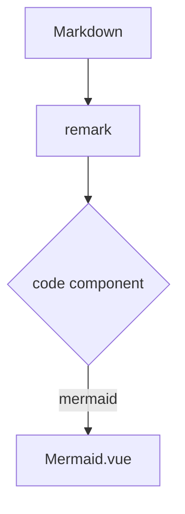

# Mermaid

[English](./mermaid.md) | **简体中文**

## 用途

从围栏代码渲染 Mermaid 图表——流程图、时序图、甘特图——接近视口时才懒加载，并适配主题配色。

## 基本语法

````md

````

## 行为

- 经[代码组件映射](./code-component.zh-CN.md)由 `Mermaid.vue` 渲染；不要写 `::mermaid`。
- 容器接近视口时才开始渲染，此后锁定。
- 颜色适配明暗模式；字体继承站点。
- 超宽图表保留画布宽度，容器横向滚动并提供适应/滚动切换。
- 解析失败时，图表替换为错误详情折叠块与原始 `mermaid` 代码块。

## 何时使用

文章确实要解释的架构、流程与时序。

## 何时不要使用

文本内容比形状更重要的图（用列表）；隐藏容器（如未激活的 Tab 面板）里的大量图表——渲染等待可见，读者在展开前可能看到空框。

## 常见错误

- 把 Mermaid 放进未激活选项卡却期待立即渲染。
- 期待围栏 meta 标志生效。

## 支持状态

`supported` —— 兼容性用例 `D-mermaid`、`D-mermaid-client` 与水合套件验证。

## 来源

`src/components/content/Mermaid.vue`；映射于 `nuxt.config.ts`；上游展示页中的用法。
