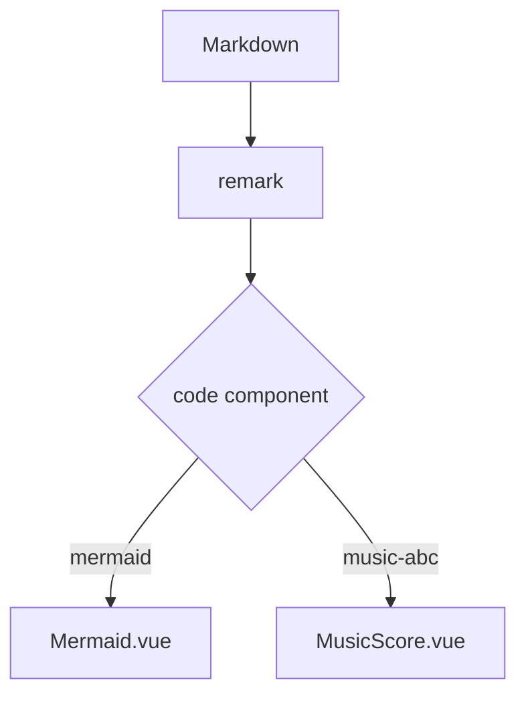
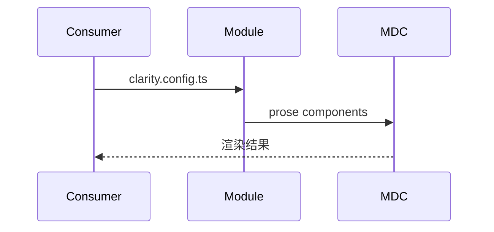

# Mermaid

```mermaid
graph TD
	A[Markdown] --> B[remark]
	B --> C{code component}
	C -->|mermaid| D[Mermaid.vue]
	C -->|music-abc| E[MusicScore.vue]
```

```mermaid
sequenceDiagram
	participant Consumer
	participant Module
	participant MDC
	Consumer->>Module: clarity.config.ts
	Module->>MDC: prose components
	MDC-->>Consumer: 渲染结果
```
