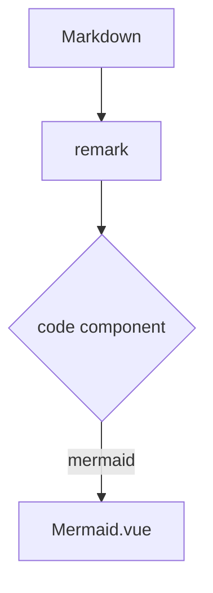

# Mermaid


## Purpose

Render Mermaid diagrams from fenced code — flowcharts, sequence diagrams, gantt charts — lazily, only when near the viewport, with theme-adapted colors.

## Basic Syntax

````md

````

## Behavior

- Rendered by `Mermaid.vue` via the [code-component mapping](./code-component.md); never write `::mermaid`.
- Rendering starts when the container approaches the viewport and locks in afterwards.
- Colors adapt to light/dark mode; fonts inherit the site.
- Wide diagrams keep their canvas width in a horizontal-scroll container with a fit/scroll toggle.
- On parse failure the diagram is replaced by an error disclosure plus the raw `mermaid` code block.

## When to Use

Architectures, flows, and sequences the article actually explains.

## When Not to Use

Diagrams whose text content matters more than the shape (use a list); many diagrams in hidden containers (e.g. inactive Tab panels) — rendering waits for visibility, so readers may see empty boxes until revealed.

## Common Mistakes

- Putting Mermaid inside inactive tabs and expecting immediate render.
- Expecting fence meta flags to apply.

## Support Status

`supported` — verified by compatibility cases `D-mermaid`, `D-mermaid-client`, and the hydration suite.

## Source

`src/components/content/Mermaid.vue`; mapping in `nuxt.config.ts`; upstream usage in the showcase.
